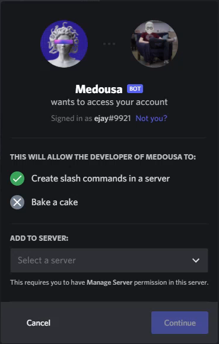
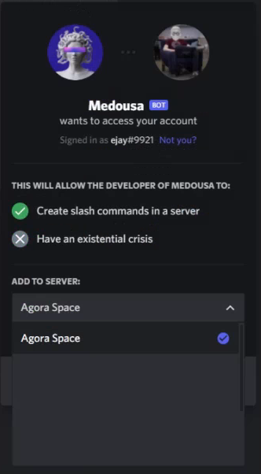
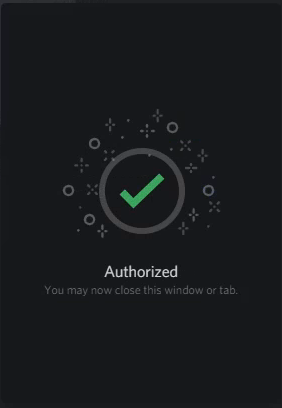
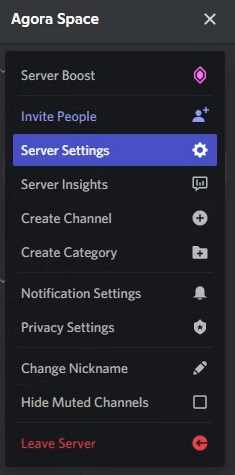
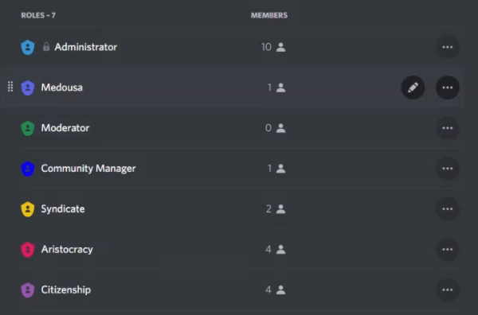

# Discord bot

## 1. Invite Medusa

Your first task is to invite Medusa through the invite link below:  
\(You must have Administrator privileges on the Discord server!\)


[https://discord.com/api/oauth2/authorize?client\_id=868172385000509460&permissions=8&scope=bot%20applications.commands](https://discord.com/api/oauth2/authorize?client_id=868172385000509460&permissions=8&scope=bot%20applications.commands)


Here is what you will see after that:

Select your server:

Confirm the Bot roles, an Administrator role is necessary to manage roles on your server.

If everything went well, you should see the following responses in your browser and in your discord server:

## 2. Check the permissions

Check for the bot Permissions in your Server Settings to change them at: / Roles / Medusa - Edit

Choose Permissions, and type “Administrator” into the search field. Make sure, Medusa has Administrator privileges.

Go back to Roles, and move Medusa above the roles, which you would like her to manage automatically based on your Community Levels. \(You can move the role with this icon:  Hold down your left mouse button and just simply drag it.\)

That's it! You are done with installing Medusa the role-management bot to guard your channels!

